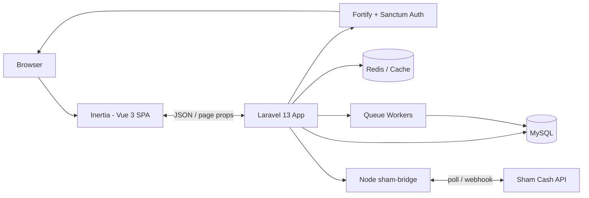

# CoreXGaming Store-app

**Multi-tenant digital goods store platform** — a SaaS where every tenant gets their own fully-branded online store for selling game keys, gift cards, and software, with automated payment processing out of the box.

Built with Laravel 13, Inertia, and Vue 3, the platform ships with row-level multi-tenancy, a hybrid Fortify + Sanctum auth stack (including Telegram login and passkeys), a wallet-based subscription billing system, and an auto-payment bridge that watches for incoming crypto payments and fulfills orders automatically.

---

## Features

- **Multi-tenant SaaS** — single database with `tenant_id` row-level isolation, per-tenant branding (logo, colors, locale, currency), custom subdomains, and a platform admin panel to manage tenants.
- **Digital goods catalog** — products with categories, providers, stock tracking, and public storefront with customer order history.
- **Automated payments** — Sham Cash auto-detection via a Node.js bridge (deposit detection, webhook processing, retry jobs) plus manual payment methods and generated payment addresses.
- **Subscriptions & wallet billing** — plan-based feature limits (free / pro / enterprise), platform wallet top-ups, recurring invoice generation, and transaction fees.
- **Admin dashboard** — real-time KPIs and charts (Chart.js), order management, payment review, provider balance sync.
- **Auth & security** — Fortify + Sanctum hybrid, Telegram authentication, two-factor authentication (TOTP), passkeys, email verification, API tokens, audit logging.
- **Internationalization** — Arabic and English locales with Vue i18n, RTL-ready UI.

---

## Tech Stack

| Layer      | Technology |
|------------|------------|
| Backend    | PHP 8.3+, Laravel 13, Fortify, Sanctum |
| Frontend   | Vue 3, Inertia 3, TypeScript, Tailwind CSS 4, Pinia, Radix Vue |
| Data       | MySQL (production), SQLite (local), Redis |
| Tooling    | Vite, Ziggy, Wayfinder, Laravel Pulse |
| Payments   | Sham Cash auto-payment bridge (Node.js) |
| QA         | PHPUnit, Pint, PHPStan, ESLint, Prettier, vue-tsc |
| CI/CD      | GitHub Actions (lint + tests) |

---

## Architecture



Requests are resolved through a tenant-identification middleware (subdomain / custom domain / header), which sets the tenant context used by global scopes to isolate every query.

---

## Getting Started

### Requirements

- PHP **8.3+**
- Composer **2.x**
- Node.js **20+** and npm
- MySQL 8+ (or SQLite for local development)
- Redis (optional for local; recommended in production)

### Setup

```bash
# 1. Clone & install dependencies
git clone https://github.com/Andres-de-Fonoliousa/store-app.git
cd store-app
composer install

# 2. Configure environment
cp .env.example .env
php artisan key:generate

# 3. Configure your database in .env, then migrate & seed
php artisan migrate --seed

# 4. Build frontend assets
npm install
npm run build

# 5. Run the dev environment (server + queue + vite + logs)
composer dev
```

Visit `http://localhost:8000` — the app serves the storefront; the admin area is under `/admin`.

> Using SQLite locally? Set `DB_CONNECTION=sqlite` in `.env` and create `database/database.sqlite`.

---

## Project Structure

```
app/
├── Http/               # Controllers, Middleware, Requests
├── Models/             # Eloquent models (Tenant, Product, Order, ...)
├── Services/           # Business logic, Tenant manager, Sham Cash bridge
├── Console/            # Commands (payment sync, retries, billing)
└── Jobs/               # Queued jobs
resources/js/
├── pages/              # Inertia pages (Public, Customer, Admin, Platform)
├── layouts/            # Layouts per area
├── stores/             # Pinia stores
└── components/         # Vue components (UI kit)
routes/                 # web.php, api.php, settings.php
sham-bridge/            # Node.js payment bridge service
deploy/                 # Deployment scripts & nginx config
.github/workflows/      # CI (lint + tests)
```

---

## Testing & QA

```bash
composer test          # Pint (style) + PHPStan (types) + PHPUnit (tests)
npm run lint           # ESLint (auto-fix)
npm run types:check    # vue-tsc --noEmit
```

CI runs automatically on push / pull requests to `main`, `master`, `develop`, and `workos` branches.

---

## Deployment

Production runs behind Nginx (see `deploy/store-app-nginx.conf`) with PHP-FPM. Ensure the queue worker (`php artisan queue:work`) and the Node `sham-bridge` service are running for automated payments, and schedule the console kernel via cron.

```bash
composer install --no-dev --optimize-autoloader
php artisan migrate --force
php artisan config:cache && php artisan route:cache
```

---

## License

MIT — see [LICENSE](LICENSE) for details.

<!-- Add screenshots here: storefront home, product detail, admin dashboard, platform admin -->
